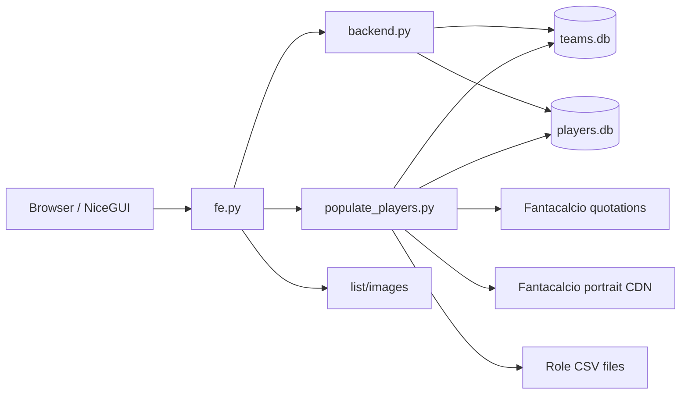

# Architecture

## Components

## `fe.py`

Owns page routing and presentation:

- Dashboard
- Team directory and reset confirmation
- Role markets and assignment dialog
- Team detail pages
- Static player-image route

NiceGUI `ui.refreshable` components update market values, personal budgets, and team cards without a browser reload.

## `backend.py`

Owns auction rules and SQLite operations:

- Remaining credits and roster slots
- Market valuation and personal maximum price
- Assignment, movement, release, and full reset
- Team and player queries
- Pre-reset database backup

## `populate_players.py`

Owns external data ingestion:

- HTML quotation parsing
- CSV generation
- Portrait caching
- Player-table rebuild
- Stale assignment cleanup

## `config.py`

Owns league-level constants, roster shape, role budgets, the personal team, and valuation multipliers.

## Valuation overview

The market value uses normalized player rating, average credits remaining per open slot, and a role multiplier. The personal maximum price uses the configured team's remaining role budget and remaining role slots. Values are rounded upward.

Earlier-role budget can roll into a later role after all earlier-role slots are filled.
