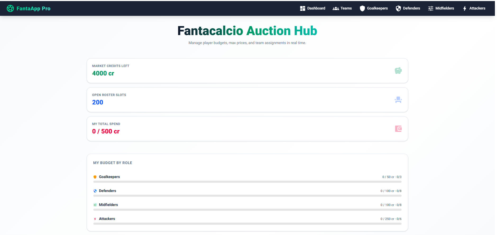
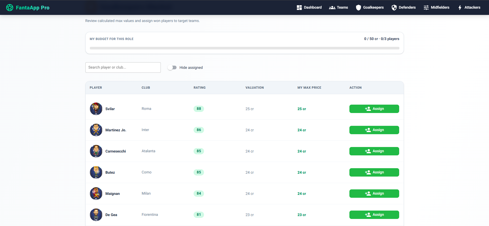
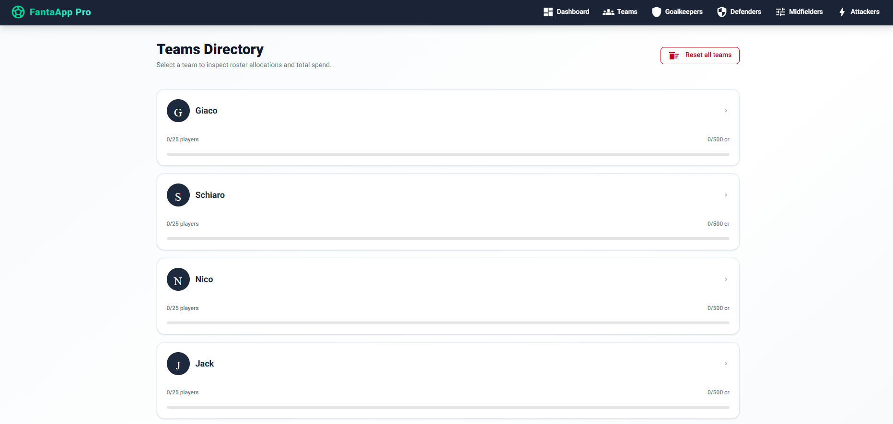
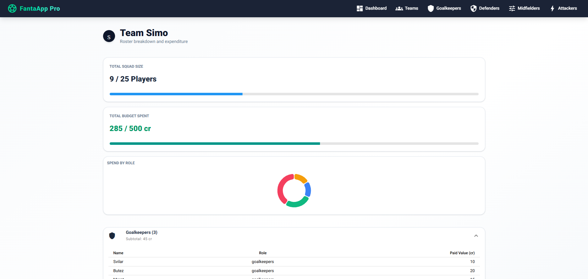

# Using the App

## Dashboard

The dashboard shows:

- Credits remaining across the auction.
- Open roster slots across all teams.
- Spending for the personal team configured by `MY_TEAM`.
- Personal budget and roster progress for each role.

Use the market cards or the navigation bar to open a role.



## Assign a player

1. Open a role market.
2. Search by player or Serie A club if needed.
3. Select **Assign** on the player row.
4. Enter the paid price.
5. Select the destination team.
6. Select **Save assignment**.

The assignment is written only when Save is selected. A player can belong to only one fantasy team; assigning the same player elsewhere moves that player to the new team.



## Edit or release a player

Assigned players show an **Edit** action and a team badge.

- Change the paid price or team, then save.
- Select **Release player** to remove the assignment and return the player to the market.

The budget bar and market row update immediately.

## Browse teams

Open **Teams** to see every roster's player count, total spend, and budget progress. Select a team card for its complete role breakdown, subtotals, sortable tables, and spending chart.



The team detail view shows squad size, total spend, spending by role, and expandable player tables.



## Reset all teams

1. Open **Teams**.
2. Select **Reset all teams**.
3. Type `RESET` exactly.
4. Select **Erase all rosters**.

The app creates a timestamped backup before deleting assignments. The team cards refresh immediately after reset.

Backups are stored under:

```text
db/teams_dataset/backups/teams_YYYYMMDD_HHMMSS.db
```
